# CardioIA · Ir Além 2 — Diagnóstico visual de ECG com rede neural MLP

> Projeto acadêmico FIAP — Curso de Inteligência Artificial · Fase 2 · Ir Além 2
> Rede neural do tipo **MLP** (Perceptron Multicamadas), em Keras, que classifica
> **imagens de batimentos cardíacos** como normais ou anormais.

**Notebook:** [`notebooks/ir_alem_2_ecg_mlp.ipynb`](../notebooks/ir_alem_2_ecg_mlp.ipynb) — abre no
GitHub já executado e roda no Google Colab sem ajuste.

---

## 1. Dados

**PTB Diagnostic ECG Database** (PhysioNet), na versão pré-processada do Kaggle recomendada pela
atividade ([`shayanfazeli/heartbeat`](https://www.kaggle.com/datasets/shayanfazeli/heartbeat)),
preparada por Kachuee, Fazeli e Sarrafzadeh (2018): derivação II, reamostrada a 125 Hz, um
batimento por linha (187 amostras, cerca de 1,5 s), amplitude normalizada entre 0 e 1.

| Classe | Batimentos | Origem |
|---|---:|---|
| normal | 4.046 | controles saudáveis |
| anormal | 10.506 | pacientes com infarto do miocárdio |

O download (cerca de 100 MB) é feito pelo próprio notebook com `kagglehub`, sem conta no Kaggle.
Os dados não são copiados para o repositório.

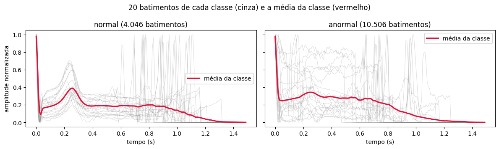

---

## 2. Das amostras à imagem

O dataset traz cada batimento como uma sequência de números. Para trabalhar com **imagens**, como
pede a atividade, cada batimento é desenhado como num eletrocardiograma impresso: traço preto
sobre papel milimetrado rosa, 128 × 256 pixels coloridos. Depois, o mesmo pré-processamento que se
aplicaria a um ECG fotografado ou digitalizado:

1. **tons de cinza** (3 canais viram 1);
2. **inversão**: traço claro, fundo escuro;
3. **redimensionamento** de 128 × 256 para 32 × 64, por média de área;
4. **normalização** em [0, 1] e **achatamento** num vetor de 2.048 valores, a entrada da MLP.

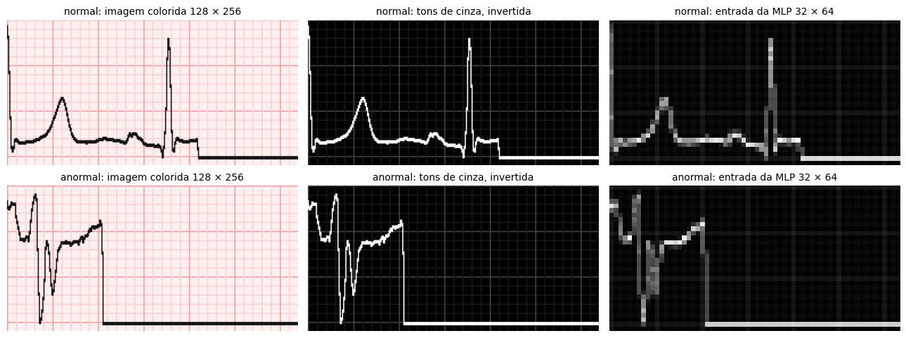

### Exemplos de imagens

Na pasta [`exemplos/`](exemplos), três batimentos de cada classe (as três primeiras linhas de cada
arquivo do dataset), gerados pelas funções `desenhar_ecg` e `preprocessar` do notebook:

| Classe | Imagem desenhada (128 × 256) | Entrada da MLP (32 × 64, ampliada 4× para visualização) |
|---|---|---|
| normal | 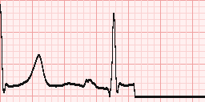 | 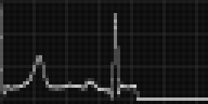 |
| normal | 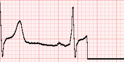 | 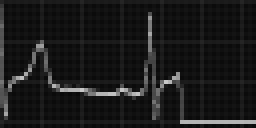 |
| anormal | 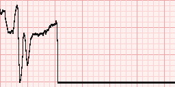 | 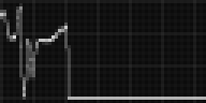 |
| anormal | 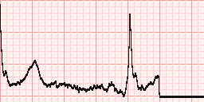 | 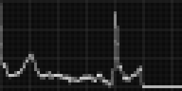 |

---

## 3. A rede MLP

| Camada | Neurônios | Papel |
|---|---:|---|
| entrada | 2.048 | um valor por pixel |
| densa + ReLU | 256 | combina pixels em padrões do traçado |
| *dropout* 30% | | contra *overfitting* |
| densa + ReLU | 128 | combina padrões em evidências |
| *dropout* 30% | | |
| densa + sigmoide | 1 | probabilidade de o batimento ser anormal |

- 557.569 pesos treináveis; otimizador Adam (taxa 0,001); perda de entropia cruzada binária.
- Divisão estratificada 70% / 15% / 15% (treino 10.186 · validação 2.183 · teste 2.183).
- **Pesos por classe** contra o desbalanceamento (72% dos batimentos são anormais).
- **Parada antecipada:** sem melhora na perda de validação por 10 épocas, o treino para e volta aos
  melhores pesos (25 épocas no total).
- Sementes fixas e operações determinísticas: o notebook reproduz os mesmos números.

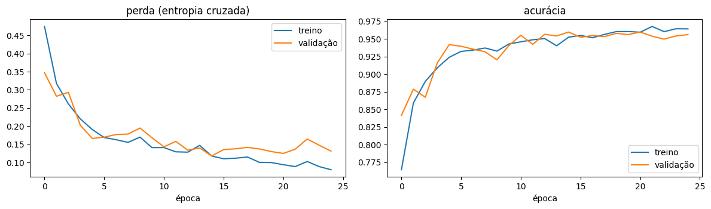

---

## 4. Resultados no teste

| Modelo (2.183 batimentos de teste) | Acurácia | Sensibilidade | Especificidade | AUC |
|---|---:|---:|---:|---:|
| **MLP sobre imagens (2.048 pixels)** | **95,6%** | **98,2%** | 89,1% | **0,990** |
| MLP sobre o sinal bruto (187 amostras) | 94,9% | 95,1% | 94,2% | 0,986 |
| Referência: responder sempre "anormal" | 72,2% | 100% | 0% | 0,5 |

Dos 2.183 batimentos, 29 de infarto passaram como normais e 66 normais viraram alarme falso. Como
referência, o artigo de origem obteve 95,9% nesta base com uma rede convolucional.

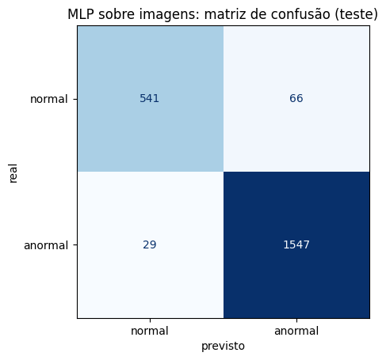

### A MLP enxerga posição, não forma

Deslocar as imagens de teste alguns pixels para a direita (o traçado é o mesmo, só muda de lugar):

| Deslocamento | 0 px | 1 px | 2 px | 4 px | 8 px |
|---|---:|---:|---:|---:|---:|
| Acurácia | 95,6% | 75,4% | 73,6% | 72,1% | 72,1% |
| AUC | 0,990 | 0,893 | 0,782 | 0,620 | 0,509 |

Um pixel basta para derrubar o desempenho. A rede aprendeu em que pixel cada parte do traçado
costuma estar, o que só funciona porque todas as imagens foram geradas alinhadas. É o argumento
para as redes convolucionais (CNN) da Fase 4.

### Onde a rede erra

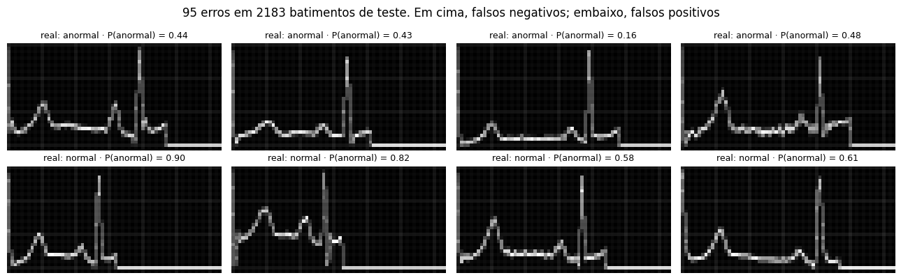

Só 40% dos 95 erros são casos de fronteira (probabilidade entre 0,3 e 0,7); os outros 60% são
erros com convicção, os mais perigosos, porque passam uma segurança que o modelo não tem.

---

## 5. Limitações e responsabilidade

- **Vazamento entre pacientes.** O CSV não identifica a pessoa de cada batimento; com divisão
  aleatória, batimentos da mesma pessoa caem no treino e no teste. Com pacientes novos, o
  desempenho tende a ser menor (paradigma interpacientes, de Chazal et al., 2004).
- **População.** A PTB tem 290 pessoas de um centro alemão: 209 homens (72%) e 81 mulheres, o mesmo
  desequilíbrio de sexo apontado na Fase 1.
- **Imagens limpas e alinhadas**, sem inclinação, sombra ou ruído de uma foto real.
- **Um batimento, uma derivação.** O diagnóstico de infarto usa 12 derivações, exames e a história
  do paciente.
- **Uso educacional.** Um classificador assim só serviria como apoio à triagem, com o médico no
  circuito e validação clínica prévia.

---

## 6. Como executar

- **Google Colab:** abrir o notebook e rodar todas as células (TensorFlow e `kagglehub` já vêm
  instalados).
- **Localmente:**

```bash
pip install tensorflow kagglehub scikit-learn pandas matplotlib notebook
jupyter notebook notebooks/ir_alem_2_ecg_mlp.ipynb
```

---

## Referências

- Kachuee M, Fazeli S, Sarrafzadeh M. ECG Heartbeat Classification: A Deep Transferable Representation. *IEEE ICHI*, 2018. arXiv:1805.00794.
- Goldberger AL et al. PhysioBank, PhysioToolkit, and PhysioNet. *Circulation.* 2000;101(23):e215–e220. PTB Diagnostic ECG Database: https://physionet.org/content/ptbdb/1.0.0/
- de Chazal P, O'Dwyer M, Reilly RB. Automatic classification of heartbeats using ECG morphology and heartbeat interval features. *IEEE Trans Biomed Eng.* 2004;51(7):1196–1206.

---

**Integrante:** Bruno de Souza Leite — RM 567213 · trabalho individual
**FIAP — Inteligência Artificial** · Fase 2 · Ir Além 2 · 2026
